# APLIKACJA WEBOWA / FRONTEND

Aplikacja webowa przygotowana w Vue.js, która umożliwia przeglądanie oraz kupowanie ofert.

### Działanie aplikacji frontendowej

Ekran startowy aplikacji pozwala ustawić filtry wyszukiwania ofert:

* Dokąd? - można wybrać dowolną ilość i kombinacje lokalizacji, nie wybranie żadnej oznacza dowolną lokalizację,

* Kiedy? - można wybrać dowolny przedział dat,

* Skąd? - analogicznie jak wybór dokąd,

* Z kim? - ilość osób w podanych grupach wiekowych.

Po wybraniu filtrów, przechodzimy do widoku przeglądania ofert spełniających wybrane kryteria z paginacją. Każda oferta posiada przycisk *Szczegóły*, który przeniesie do podstrony z szczegółowymi informacjami na temat wybranej oferty.

Na podstronie szczegółów oferty znajduje się przycisk *Rezerwuj*, który rezerwuje zasoby związane z ofertą i przeprowadza jej zakup. Wywołanie zakupu oferty wymaga bycia zalogowanym, które jest dostępne z każdej podstrony aplikacji.

### Komunikacja z API

Wszystkie endpointy do komunikacji z API są wylistowane w [endpoints.md](https://github.com/VeryGoodTravel/vgt-web-app/blob/main/endpoints.md) wraz z ścieżką do definicji formatu dla danego endpointu. Do zdefiniowania i walidacji formatu wiadomości została użyta **json-schema**. Schemy wszystkich wiadomości znajdują się w `/src/schemas`.
